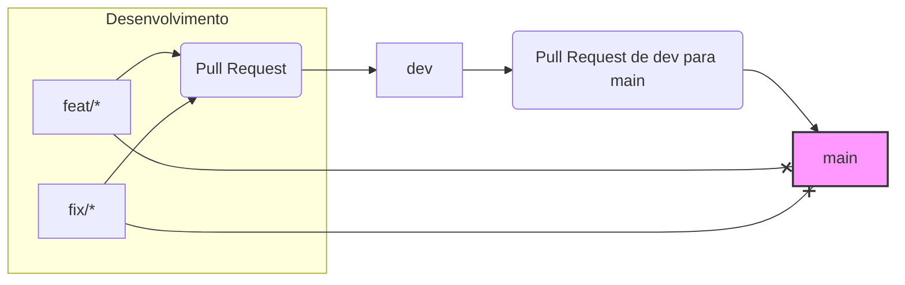

O objetivo é configurar as regras de proteção no GitHub para as branches main e dev para garantir o seguinte fluxo:

Desenvolvimento acontece em branches de feature (feat/*) ou correção (fix/*).
Mudanças das branches feat/* ou fix/* são integradas na branch dev via Pull Request, exigindo aprovação de pelo menos 2 pessoas.
A branch main só pode receber atualizações diretamente da branch dev, também via Pull Request. Outras branches não conseguirão criar PRs diretamente para main.

## Fluxo Visual Simplificado

*Note: O diagrama acima é uma representação simplificada. A exigência de 2 aprovações no PR para `develop` e as restrições diretas para `master` são garantidas pelas regras de proteção do GitHub.*

